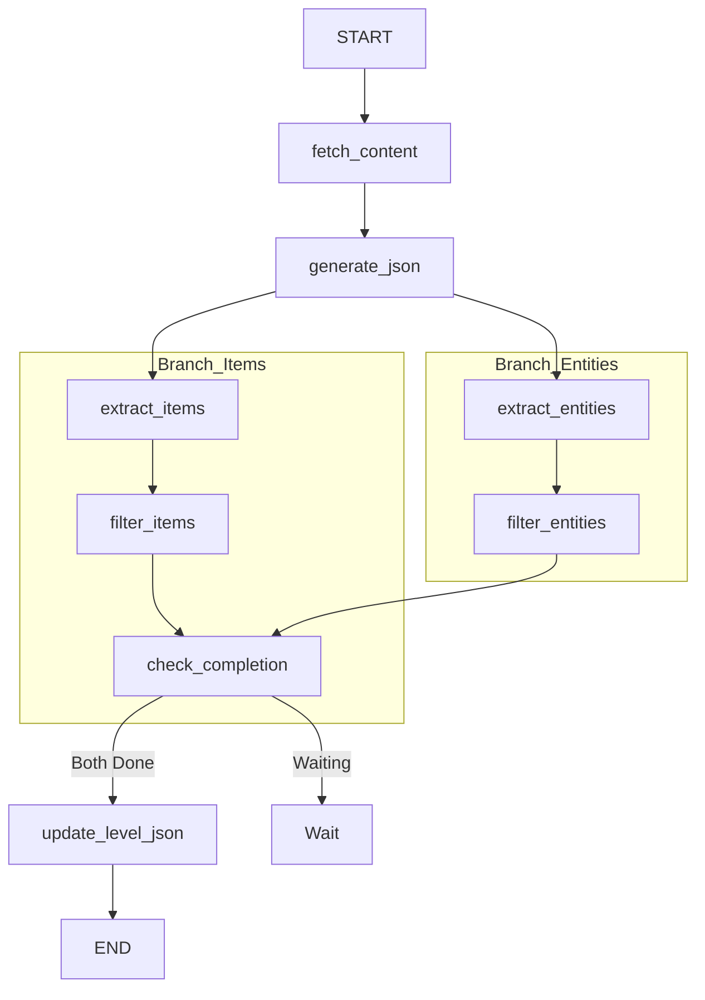

# Level Subagent Documentation

The **Level Subagent** is a specialized LangGraph workflow responsible for ingesting Backrooms wiki pages and converting them into structured game data. It extracts narrative descriptions, environmental mechanics, and RPG elements (items, entities) to populate the game's database.

## Architecture Overview

The agent follows a linear-parallel processing flow:
1.  **Fetch**: Retrieves HTML content from the wiki (or local cache).
2.  **Base Generation**: Uses LLM to create the core Level JSON (descriptions, survival class, atmosphere).
3.  **Extraction (Parallel)**:
    *   **Branch A**: Extracts findable items.
    *   **Branch B**: Extracts entities.
4.  **Filtering**: Validates extracted elements (Hallucination check).
5.  **Merge**: Updates the final JSON file and saves individual element files.

> **Note**: Vector Store updates are **not** performed within this agent. They are handled by the batch post-processing script (`scripts/rebuild_vector_store.py`) to optimize performance.

---

## State Definition (`LevelAgentState`)

The agent's state is defined in `state.py` and strictly grouped by the node responsible for populating the data.

| Field | Type | Source Node | Description |
| :--- | :--- | :--- | :--- |
| `force_update` | `bool` | Input | If True, bypasses existing caches and regenerates data. |
| `logs` | `List[str]` | *Shared* | Accumulates execution logs and error messages. |
| `url` | `str` | Input/Fetch | The target Wiki URL. |
| `level_name` | `str` | Fetch | Normalized level identifier (e.g., `level-0`). |
| `html_content` | `str` | Fetch | Cleaned HTML DOM text used for LLM context. |
| `extracted_links` | `List[Dict]` | Fetch | Hyperlinks found in the page (sub-zones, layers). |
| `level_json_generated`| `bool` | Generate | Flag indicating base JSON success. |
| `extracted_items_raw`| `List[Dict]`| Extract | Raw item candidates from LLM. |
| `extracted_entities_raw`| `List[Dict]`| Extract | Raw entity candidates from LLM. |
| `final_items` | `List[Dict]` | Filter | Verified items ready for DB. |
| `final_entities` | `List[Dict]` | Filter | Verified entities ready for DB. |
| `items_extracted` | `bool` | Filter | Signal that item branch is done. |
| `entities_extracted` | `bool` | Filter | Signal that entity branch is done. |

---

## Workflow Graph



---

## Node Details

### 1. `fetch_content_node`
- **File**: `nodes/fetch.py`
- **Logic**:
  1. Determines the best Wiki URL (handling mirrors).
  2. Fetches HTML content.
  3. **Fallback**: If network fails but `force_update` is True, attempts to load raw HTML from `data/raw/` and re-clean it.
  4. Parses HTML to remove empty tags (`<div>`, `<p>`, `<span>`) and extracts `<a>` links.
- **Output**: `html_content`, `level_name`, `extracted_links`.

### 2. `generate_json_node`
- **File**: `nodes_llm.py`
- **Prompt**: `prompts/generate_json.prompt`
- **Logic**:
  - Uses the cleaned HTML to generate the main Level JSON.
  - Fields: `title`, `survival_difficulty`, `atmosphere`, `environmental_mechanics`, `sub_zones`, `factions`.
  - **Optimization**: Skips generation if JSON exists and `force_update` is False.
- **Output**: Writes `data/level/{level}.json`.

### 3. `extract_items_node` / `extract_entities_node`
- **File**: `nodes_llm.py`
- **Prompt**: `prompts/extract_items.prompt` / `prompts/extract_entities.prompt`
- **Logic**:
  - **Items**: Identifies lootable objects. Generates a unique `id` based on the English name (singular).
  - **Entities**: Identifies entities. Generates a unique `id` based on the English name (singular).
  - **Constraints**: No generic `name_en` array anymore; ID must be strict.
- **Output**: `extracted_items_raw`, `extracted_entities_raw`.

### 4. `filter_items_node` / `filter_entities_node`
- **File**: `nodes/filter.py`
- **Logic**:
  - **Hallucination Check**: Verifies that the extracted `name` actually appears in the source HTML text.
  - **Similarity Check**: *Disabled/Removed* to verify faster batch processing. Deduping logic is deferred.
- **Output**: `final_items`, `final_entities`.

### 5. `check_completion_node`
- **File**: `nodes/update.py` (Dummy) / `graph.py` (Logic)
- **Logic**: synchronization barrier. Waits for both parallel branches (`items_extracted` and `entities_extracted`) to be True before proceeding to the final update.

### 6. `update_level_json_node`
- **File**: `nodes/update.py`
- **Logic**:
  1. Loads the existing `data/level/{level}.json`.
  2. Merges `findable_items`, `entities`, and `links` into the JSON.
  3. JSON Dump: Saves the updated file.
  4. Saves individual files to `data/item/{category}/{id}.json` and `data/entity/{id}.json`.
  5. **Note**: Explicitly logs that Vector Store update is skipped.

---

## Usage

### Single Run
```bash
python scripts/run_level_agent.py level-0 --force
```

### Batch Run (Recommended)
```bash
# Runs process for Level 0 to 20, keeping vector DB offline, then rebuilds once at the end.
python scripts/batch_run_levels.py 0 20
```
