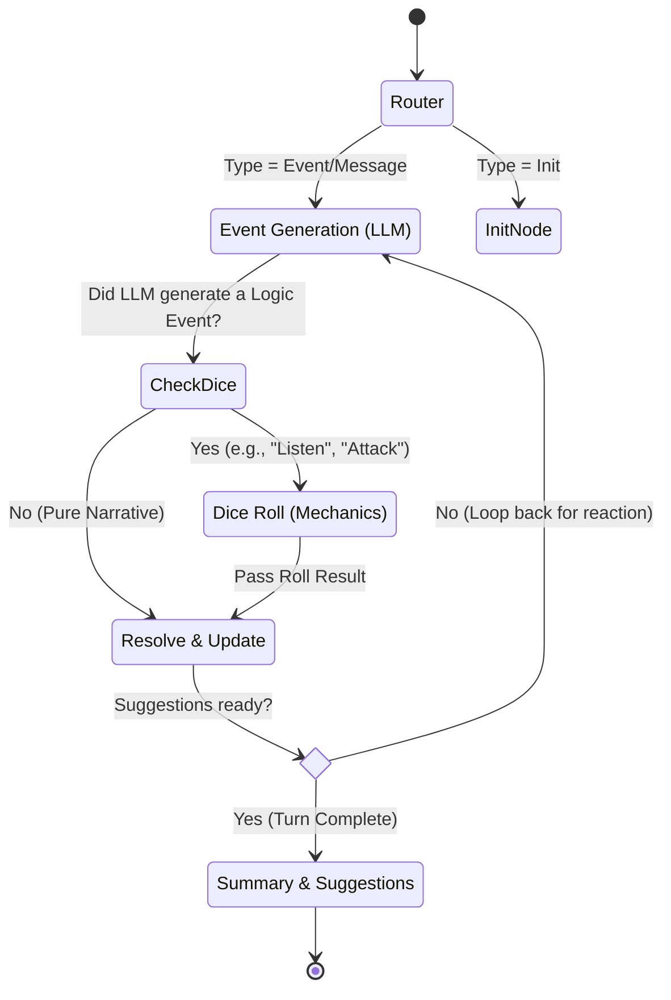
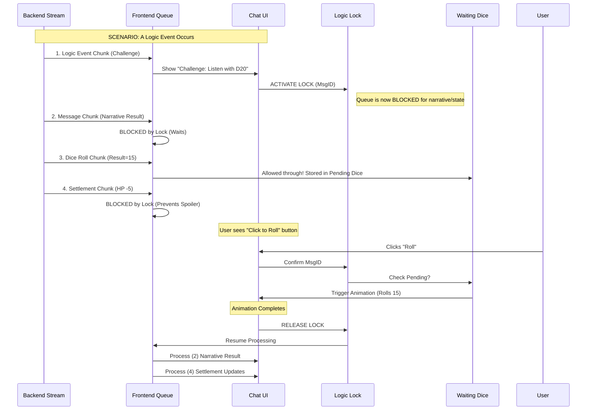
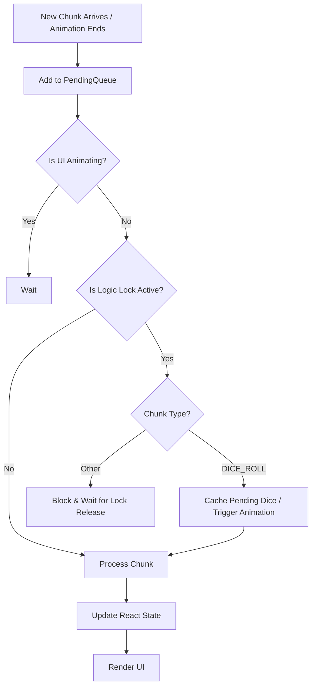

# Backroom Agent System Architecture

This document visualizes the internal logic of the Backroom Agent Game Engine, covering both the Python Backend (Logic Core) and the Typescript Frontend (State Management).

## 1. System Overview

The system consists of a React Frontend that communicates with a FastAPI Python Backend via HTTP Streaming (NDJSON).

```mermaid
graph TD
    User([Player]) <-->|Interacts| FE[Frontend (React/Vite)]
    
    subgraph "Frontend Engine (useGameEngine)"
        FE_Queue[Event Queue]
        FE_State[Game State]
        FE_Logic[Logic/Dice Lock]
    end
    
    FE <-->|HTTP Stream (NDJSON)| API[FastAPI Server]
    
    subgraph "Backend Agent (Python)"
        API <--> Router[Router Node]
        Router --> Graph[LangGraph Agent]
        Graph <--> Tools[Tools / Vector Store]
        Graph <--> Memory[Redis Memory]
    end
    
    Graph <-->|Inference| LLM[LLM (GPT-4)]
```

## 2. Backend Game Loop (LangGraph)

The core narrative logic runs on a directed cyclic graph. It decides whether to just generate text, perform a dice roll (Logic Event), or resolve the turn.



## 3. Frontend Streaming & Logic Lock

The Frontend `useGameEngine` hook acts as a specialized state machine that handles the asynchronous stream while enforcing narrative pacing (preventing spoilers).

### The Logic Lock Mechanism

This ensures the user sees the **Dice Animation** *after* the **Challenge** is presented but *before* the **Result** is revealed.



## 4. Frontend Queue Logic (Detailed)

How the `tryProcessQueue` function decides what to process next.


